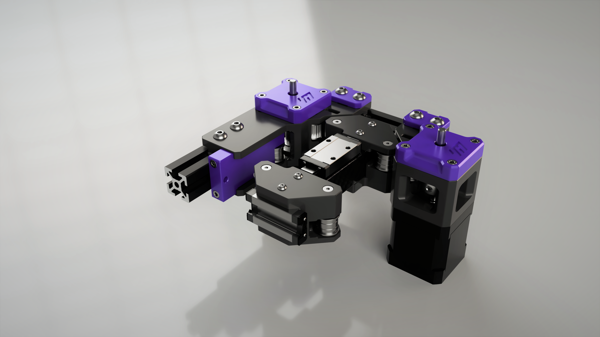

# Monolith Gantry for V2 and VT [BETA]

## What's this?
This is a performance oriented, configurable gantry system for Voron 2.4 and Trident. It brings VZbot AWD simplicity and Voron space efficiency together.
## Prerequisites for Monolith AWD
- 5mm or double 3mm foam tape under the rear and the front panels, because there's a 3.6mm stepper protrusion
- OR a 4040 frame
- 9 stepper drivers (or CAN) for V2
- 8 stepper drivers for Trident
- VZ-Hevort CNC toolhead for no build volume loss (Trident may need bed relocation)
- OR an Archetype based toolhead with remixed belt clamping (all of them lose build volume, Breakneck, Atrocity and Mjölnir are promising, the others probably won't fit)
- OR a toolhead that you made compatible with this gantry
## BOM
### DISCLAIMER: A lot of this stuff is untested, so BOM and files will change with more testing and feedback.
### Rails:
- Y rails: MGN9H

- X rail: MGN9H/MGN12H
### X axis:
- FRONT X RAIL: any stock-compatible X beam will work with the suitable mounting hardware (remixed XY joints may be required).

- TOP X RAIL, any stock-compatible X beam that can be rotated 90 degrees and can accommodate new XY joint holes will work.

To keep the BOM lists relatively simple, I'm going to include all the hardware and motion parts for the motor mounts and XY joints (with the stock stuff included). X extrusion/tube mounting hardware is not included because that can vary based on the configuration.
### [V2.4|6mm|AWD] motor mounts and XY joints
|No.|Description|Qty|
|---|---|---|
|1.|NEMA17 motors (preferably identical)|4 pcs|
|2.|GT2 20T drive pulley 6mm|4 pcs|
|3.|F695 flanged bearing|12 pcs|
|4.|6mm GT2 20T Idler (16mm OD max.)|4 pcs|
|5.|6mm GATES GT2 belt|4 m|
|6.|Round aluminum M3 standoff 25x5mm (dowel pins or smooth rods will also work)|8 pcs|
|7.|5x20mm dowel pin/smooth rod (Round aluminum M3 standoffs 20x5mm will also work)|2 pcs|
|8.|M5 1mm spacer|8 pcs|
|9.|M3x6 BHCS|4 pcs|
|10.|M3x10 BHCS|4 pcs|
|11.|M3x30 BHCS|8 pcs|
|12.|M3x8 FHCS|11 pcs|
|13.|M3x12 SHCS|2 pcs|
|14.|M3x35 SHCS|16 pcs|
|15.|M3x40 SHCS|2 pcs|
|16.|M3 washer (7mm OD max.)|2 pcs|
|17.|M3x5x4mm heatset inserts| 10 pcs|
|18.|M5x10 BHCS|8 pcs|
|19.|M5x12 BHCS|4 pcs|
|20.|M5x16 BHCS|8 pcs|
|21.|M5 washer (10mm OD max.)|4 pcs|
|22.|M3 roll in T-nut|2 pcs|
|23.|M5 roll in T-nut|28 pcs|
|24.|M2 self tapping screw|2 pcs|

### [V2.4|9mm|AWD] motor mounts and XY joints
|No.|Description|Qty|
|---|---|---|
|1.|long shafted (S35/S55/S80) NEMA17 motors (preferably identical)|4 pcs|
|2.|GT2 20T drive pulley 9 mm|4 pcs|
|3.|F695 flanged bearing|12 pcs|
|4.|695ZZ bearing|10 pcs|
|5.|9mm GT2 20T Idler (16 mm OD max.)|4 pcs|
|6.|9mm GATES GT2 belt|4 m|
|7.|Round aluminum M3 standoff 30x5mm (dowel pins or smooth rods will also work)|8 pcs|
|8.|5x20mm dowel pin/smooth rod (Round aluminum M3 standoffs 20x5mm will also work)|2 pcs|
|9.|M5 1mm spacer|8 pcs|
|10.|M3x6 BHCS|4 pcs|
|11.|M3x10 BHCS|4 pcs|
|12.|M3x35 BHCS|8 pcs|
|13.|M3x8 FHCS|11 pcs|
|14.|M3x12 SHCS|2 pcs|
|15.|M3x45 SHCS|16 pcs|
|16.|M3x40 SHCS|2 pcs|
|17.|M3 washer (7 mm OD max.)|2 pcs|
|18.|M3x5x4 mm heatset inserts| 10 pcs|
|19.|M5x12 BHCS|12 pcs|
|20.|M5x16 BHCS|8 pcs|
|21.|M5 washer (10 mm OD max.)|4 pcs|
|22.|M3 roll in T-nut|2 pcs|
|23.|M5 roll in T-nut|28 pcs|
|24.|M2 self tapping screw|2 pcs|

### GE5C Z joints (only for 6mm belts)
|No.|Description|Qty|
|---|---|---|
|1.|GE5C bearing|4 pcs|
|2.|M3x16 SHCS|16 pcs|
|3.|M5x16 SHCS|4 pcs|
|4.|M5x20 SHCS|4 pcs|
|5.|M5 1mm spacer|4 pcs|

### Rigid Z joints (6 and 9mm belts)
|No.|Description|Qty|
|---|---|---|
|1.|M3x25 SHCS|16 pcs|
|2.|M5x40 SHCS|8 pcs|

### [VT|6mm|AWD] motor mounts and XY joints
|No.|Description|Qty|
|---|---|---|
|1.|NEMA17 motors (preferably identical)|4 pcs|
|2.|GT2 20T drive pulley 6mm|4 pcs|
|3.|F695 flanged bearing|12 pcs|
|4.|6mm GT2 20T Idler (16mm OD max.)|4 pcs|
|5.|6mm GATES GT2 belt|4 m|
|6.|Round aluminum M3 standoff 25x5mm (dowel pins or smooth rods will also work)|8 pcs|
|7.|5x20mm dowel pin/smooth rod (Round aluminum M3 standoffs 20x5mm will also work)|2 pcs|
|8.|M5 1mm spacer|8 pcs|
|9.|M3x6 BHCS|4 pcs|
|10.|M3x10 BHCS|4 pcs|
|11.|M3x30 BHCS|8 pcs|
|12.|M3x8 FHCS|11 pcs|
|13.|M3x12 SHCS|2 pcs|
|14.|M3x35 SHCS|16 pcs|
|15.|M3x40 SHCS|2 pcs|
|16.|M3 washer (7mm OD max.)|2 pcs|
|17.|M3x5x4mm heatset inserts| 10 pcs|
|18.|M5x10 BHCS|8 pcs|
|19.|M5x12 BHCS|4 pcs|
|20.|M5x16 BHCS|8 pcs|
|21.|M5 washer (10mm OD max.)|4 pcs|
|22.|M3 roll in T-nut|2 pcs|
|23.|M5 roll in T-nut|28 pcs|
|24.|M2 self tapping screw|2 pcs|

### [VT|9mm|AWD] motor mounts and XY joints
|No.|Description|Qty|
|---|---|---|
|1.|long shafted (S35/S55/S80) NEMA17 motors (preferably identical)|4 pcs|
|2.|GT2 20T drive pulley 9 mm|4 pcs|
|3.|F695 flanged bearing|12 pcs|
|4.|695ZZ bearing|10 pcs|
|5.|9mm GT2 20T Idler (16 mm OD max.)|4 pcs|
|6.|9mm GATES GT2 belt|4 m|
|7.|Round aluminum M3 standoff 30x5mm (dowel pins or smooth rods will also work)|8 pcs|
|8.|5x20mm dowel pin/smooth rod (Round aluminum M3 standoffs 20x5mm will also work)|2 pcs|
|9.|M5 1mm spacer|8 pcs|
|10.|M3x6 BHCS|4 pcs|
|11.|M3x10 BHCS|4 pcs|
|12.|M3x35 BHCS|8 pcs|
|13.|M3x8 FHCS|11 pcs|
|14.|M3x12 SHCS|2 pcs|
|15.|M3x45 SHCS|16 pcs|
|16.|M3x40 SHCS|2 pcs|
|17.|M3 washer (7 mm OD max.)|2 pcs|
|18.|M3x5x4 mm heatset inserts| 10 pcs|
|19.|M5x12 BHCS|12 pcs|
|20.|M5x16 BHCS|8 pcs|
|21.|M5 washer (10 mm OD max.)|4 pcs|
|22.|M3 roll in T-nut|2 pcs|
|23.|M5 roll in T-nut|28 pcs|
|24.|M2 self tapping screw|2 pcs|